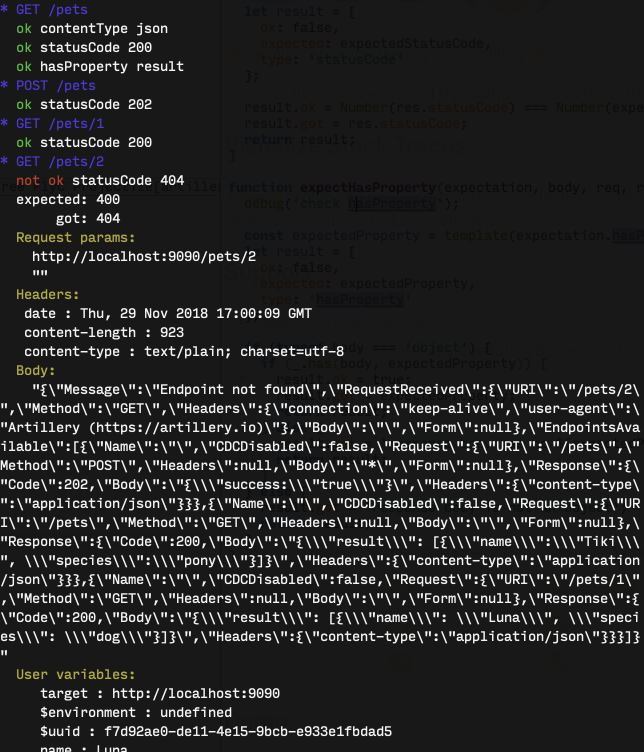

# artillery-plugin-expect

## Functional API testing with Artillery

Add expectations to your HTTP scenarios for functional API testing with Artillery.

🐞 Please report issues over at [https://github.com/shoreditch-ops/artillery/issues](https://github.com/shoreditch-ops/artillery/issues)

## Usage

### Install the plugin

```
npm install -g artillery-plugin-expect
```

**Important**: this plugin requires Artillery `v1.6.0-26` or higher.

### Enable the plugin in the config section

```yaml
config:
  target: "http://example.com"
  plugins:
    expect: {}
```

### Use expectations on your requests

```yaml
scenarios:
  - name: Get pets
    flow:
      - get:
          url: "/pets"
          capture:
            - json: "$.name"
              as: name
          expect:
            - statusCode: 200
            - contentType: json
            - hasProperty: results
            - equals:
              - "Tiki"
              - "{{ name }}"
```

### Run your test & see results

Run your script that uses expectations with:

```
artillery run --quiet my-script.yaml
```

The `--quiet` option is to stop Artillery from printing its default reports to the console.

Failed expectations provide request and response details:



### Re-using scenarios as load tests or functional tests

This plugin allows for the same scenario to be re-used for either load testing or functional testing of an API. (The only real difference between the two, of course, is how many virtual users you run -- only one for functional tests, and `$BIG_NUMBER` for a load test.)

In practical terms, what you probably want to do is use the [`environments` functionality](https://artillery.io/docs/script-reference/#environments) in Artillery to create a separate "environment" with configuration for functional testing. Something like:

```yaml
config:
  target: "https://my.api.internal"
  environments:
    #
    # This is our load testing profile, where we create a lot of virtual users.
    # Note that we don't load the plugin here, so that we don't see the output
    # from the plugin.
    #
    load:
      phases:
        - duration: 600
          arrivalRate: 10
    #
    # This is our functional testing profile, with a single virtual user, and
    # the plugin enabled.
    #
    functional:
      phases:
        - duration: 1
          arrivalCount: 1
      plugins:
        expect: {}
scenarios:
  # Your scenario definitions go here.
```

## Expectations

### `statusCode`

Check that the response status code equals the code given.

```
expect:
  - statusCode: 201
```

### `contentType`

Check the value of [`Content-Type`](https://developer.mozilla.org/en-US/docs/Web/HTTP/Headers/Content-Type) header.

### `hasProperty`

When the response is JSON, check that the response object has a property. Same as [`lodash#has`](https://lodash.com/docs/#has).

```
expect:
  - hasProperty: 'data[0].id'
```

### `equals`

Check that two or more values are the same. **NOTE** only primitive values (e.g. booleans, strings and numbers) are currently supported.

```
- get:
    url: "/pets/f037ed9a"
    capture:
      - json: "$.species"
        as: species
    expect:
      - equals:
          - "{{ species }}"
          - "dog"
```

## License

MPL 2.0
